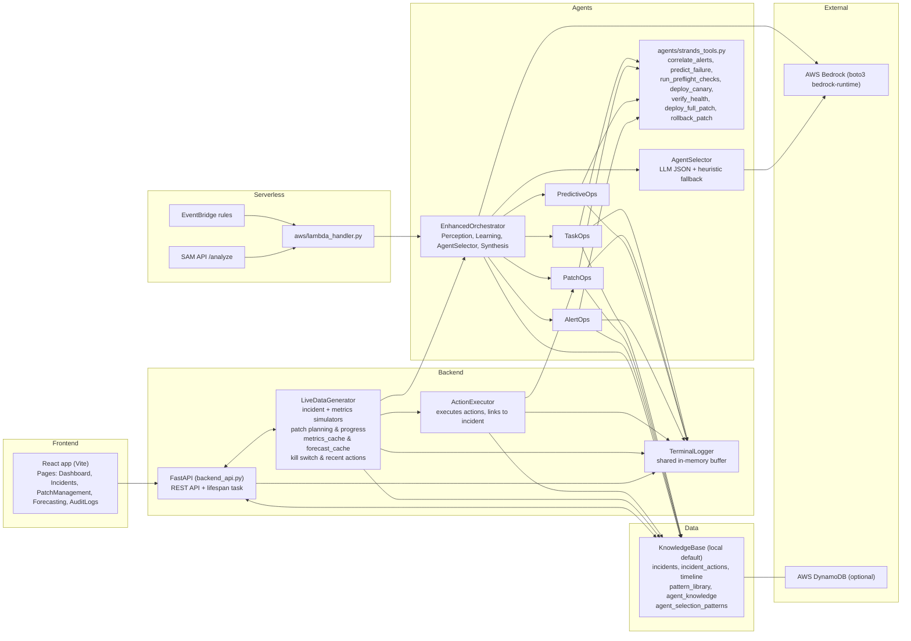

OpsForge AI — Agentic IT Operations (Prototype)
================================================

Overview
--------
OpsForge AI is a prototype agentic IT operations platform. It continuously simulates incidents and metrics, correlates alerts, predicts risks, plans patches safely, executes routine tasks, and exposes its state via a FastAPI backend consumed by a React dashboard. It is designed to run locally in a fully simulated mode, and optionally integrate with AWS Bedrock for LLM reasoning and DynamoDB for persistence.

Key Capabilities
----------------
- Alert correlation: Graph-based clustering plus LLM synthesis (AlertOps).
- Predictive analysis: Trend forecasting and risk scoring (PredictiveOps).
- Patch management: Preflight, canary, health verification, full rollout, rollback (PatchOps).
- Task automation: Routine operations such as restarts, cleanup, backups (TaskOps).
- Orchestration: Agent selection, perception, learning, and unified synthesis (Orchestrator).
- Observability: Incidents, timelines, audit logs, metrics, forecasting, and terminal logs API.
- Safety: Global kill switch to pause generation and block autonomous actions.

Architecture
------------

Directory Layout (selected)
---------------------------
- `backend_api.py` — FastAPI app, routes, lifespan startup of the live generator.
- `live_data_generator.py` — Incident and metrics simulation, patch plans, metrics/forecasts, recent actions, kill switch.
- `agents/` — Specialist agents and orchestrator:
  - `orchestrator.py` — Enhanced orchestrator (perception, learning, selection, synthesis).
  - `alert_ops.py`, `predictive_ops.py`, `patch_ops.py`, `task_ops.py` — Agent behaviors.
  - `strands_tools.py` — Deterministic tool functions (correlation, prediction, patch steps, task runners).
- `config/` — Infrastructure and utilities:
  - `bedrock_client.py` — Anthropic-compatible messages API over AWS Bedrock runtime.
  - `knowledge_base.py` — In-memory knowledge base with optional DynamoDB backing.
  - `text_formatter.py` — Formatting helpers for UI.
  - `terminal_logger.py` — Shared terminal log buffer with output modes.
  - `agent_selector.py`, `learning.py`, `perception.py` — Orchestrator support.
- `data/` — Pydantic models and simulators for alerts and metrics.
- `frontend/` — Vite + React dashboard.
- `aws/` — Serverless (SAM) template and Lambda handler (alternative deployment path).

Quick Start (Local Development)
-------------------------------
Prerequisites: Python 3.10+, Node 18+, AWS CLI configured if using Bedrock.

Backend
1. Create and activate a virtual environment.
   - Linux/macOS: `python3 -m venv .venv && source .venv/bin/activate`
   - Windows (PowerShell): `python -m venv .venv; .\.venv\Scripts\Activate.ps1`
2. Install dependencies: `pip install -r requirements.txt`
3. Optional environment variables:
   - `CORS_ORIGIN` (default `http://localhost:5173`)
   - `AWS_REGION` (default `us-east-1`)
   - `STRANDS_MODEL_ID` (default `claude-sonnet-4-20250514`)
   - `TERMINAL_OUTPUT` — `full` (default), `selective`, or `none`
4. Start the backend: `python backend_api.py`
   - Runs FastAPI on `http://0.0.0.0:8000` with lifespan task launching the generator loop.

Frontend
1. `cd frontend`
2. `npm install`
3. Optional: set `VITE_API_BASE` in `.env` (default `http://localhost:8000/api`).
4. `npm run dev` — open the URL printed by Vite (typically `http://localhost:5173`).

Simulating Activity
-------------------
The generator starts idle. Use the API or UI buttons to control simulation and safety.

- Start simulation: `POST /api/simulation/start`
- Stop simulation: `POST /api/simulation/stop`
- Simulation state: `GET /api/simulation/status`
- Kill switch toggle: `POST /api/kill-switch/toggle`
- Kill switch state: `GET /api/kill-switch/status`
- Terminal output mode: `POST /api/terminal-output-mode` with `{ "mode": "full|selective|none" }`

Core API Endpoints
------------------
- Metrics: `GET /api/metrics` — aggregate KPIs (alertsReduced, mttrReduction, tasksAutomated, activeIncidents, patchesPending, upcomingRisks).
- Agents: `GET /api/agents` — per-agent status, action counts, last activity time.
- Incidents: `GET /api/incidents` — recent incidents; `GET /api/incidents/{id}` — detail with timeline and audit logs.
- Actions: `GET /api/actions/recent` — recent actions summary.
- Patches: `GET /api/patches` — plans; `GET /api/patches/{id}` — canary phases and checks.
- Forecasts: `GET /api/forecasts` — 24h CPU/memory trends and upcoming risks.
- Audit logs: `GET /api/audit-logs` — global view or `?incident_id=...` for a specific incident.
- Logs: `GET /api/logs?limit=...&log_type=...` — terminal logs for the live viewer.

LLM and Persistence
-------------------
AWS Bedrock (LLM)
- Used by orchestrator and agents via `config/bedrock_client.py`.
- Requires AWS credentials with `bedrock:InvokeModel` permission and access to the selected Anthropic model.
- Configure `AWS_REGION` and optionally `STRANDS_MODEL_ID`.
- If LLM calls fail or are throttled, the system continues in a degraded mode where possible (e.g., selector fallback).

DynamoDB (optional)
- A local in-memory knowledge base is enabled by default (`kb = KnowledgeBase(use_local=True)`).
- To use DynamoDB, define required tables (`config/dynamodb_schema.py`) and switch to `use_local=False` in `config/knowledge_base.py`.
- Tables: incidents, pattern library, agent knowledge (GSIs defined where applicable).

Serverless (Optional)
---------------------
- SAM template: `aws/template.yaml` — defines a Lambda function and API Gateway route (`/analyze`) plus EventBridge rules.
- Lambda handler: `aws/lambda_handler.py` — routes alert/metric/full-incident events to the orchestrator path.
- Build and deploy with AWS SAM CLI. Ensure IAM permissions for Bedrock and any selected persistence.

Terminal Logs and Observability
-------------------------------
- Backend prints are controlled by `TERMINAL_OUTPUT` and also buffered in `TerminalLogger` for UI consumption.
- Log types include: GENERATOR, ORCHESTRATOR, ALERTOPS, PREDICTIVEOPS, PATCHOPS, TASKOPTS, LEARNING, PERCEPTION, SYNTHESIS, INCIDENT, SUCCESS, WARNING, ERROR, START, STOP, METRICS, INFO.
- UI provides filters, output mode control, and CSV export for incidents and audit logs.

Security and Safety
-------------------
- Kill switch halts incident generation, blocks action execution, and pauses patch progress across the system.
- CORS origins are restricted via `CORS_ORIGIN` (comma-separated allowed origins).
- Store AWS credentials securely; restrict Bedrock and DynamoDB access per least privilege.
- Do not expose the backend publicly without a proper ingress layer (ALB/API Gateway) and authentication.

Troubleshooting
---------------
- CORS errors: set `CORS_ORIGIN` to the frontend origin (e.g., `http://localhost:5173`).
- Bedrock errors: verify AWS credentials, region, and model entitlement; check `bedrock:InvokeModel` permissions.
- DynamoDB usage: create tables via `config/dynamodb_schema.py` and ensure `use_local=False` before switching.
- Frontend cannot reach backend: confirm `VITE_API_BASE` and backend host/port; verify backend is running on `:8000`.
- No incidents appearing: start simulation (`POST /api/simulation/start`) and check `/api/logs` for activity.

Known Notes
-----------
- The local prototype is resilient to partial failures (e.g., agent LLM errors) and continues processing with degraded outputs where applicable.
- The Lambda handler references orchestrator usage; ensure the orchestrator symbol aligns with the implementation before deploying serverless.

License
-------
No license is included. Consult the repository owner before reuse or distribution.
