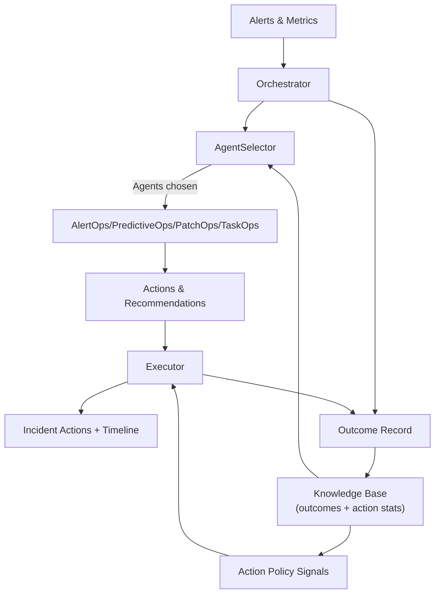
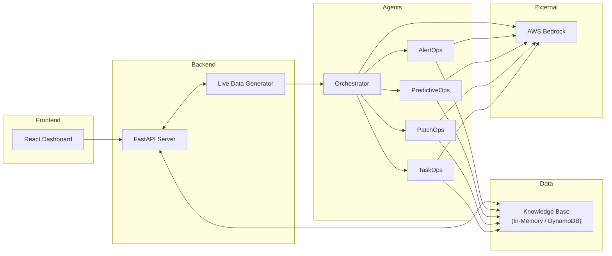

# OpsForge AI - Agentic IT/MSP Operations (Prototype)

## Overview

OpsForge AI is an agentic IT operations platform designed to simulate and autonomously manage a modern IT environment. It continuously generates incidents and metrics, correlates alerts into actionable incidents, predicts operational risks, plans and executes safe patch deployments, and automates routine tasks. Its state is exposed via a FastAPI backend, which is consumed by a real-time React dashboard.

The system is built to run locally in a fully simulated mode, with AWS Bedrock for narrative/synthesis assistance while core agents remain tool-driven and learn continuously from feedback; AWS DynamoDB provides persistent storage when enabled. Agents capture outcomes and action results to refine selection thresholds and remediation policies over time without altering existing API shapes.

## Key Capabilities

*   **Alert Correlation**: Utilizes graph-based clustering with feedback-driven synthesis (LLM is only used for narrative summaries) to reduce alert noise and identify core incidents (AlertOps).
*   **Predictive Analysis**: Employs time-series forecasting (ETS/Holt linear) to predict resource consumption spikes and identify potential future risks (PredictiveOps).
*   **Safe Patch Management**: Implements a robust patching workflow including pre-flight checks, canary deployments, health verification, phased rollouts, and automated rollbacks (PatchOps).
*   **Task Automation**: Executes routine operational tasks such as service restarts, cache clearing, and backups to maintain system health (TaskOps).
*   **Intelligent Orchestration**: A central orchestrator handles perception, learning, agent selection, and synthesis of findings from specialist agents.
*   **Comprehensive Observability**: The frontend provides a dashboard with views for incidents, patch management, forecasting, and audit logs, along with a live terminal viewer for system logs.
*   **System Safety**: A global kill switch allows for the immediate halt of all incident generation and autonomous actions, providing a crucial safety layer.

## Architecture

The system is composed of a Python backend, AI agents, a data simulation layer, and a React frontend.

PredictiveOps pairs a deterministic ETS (Holt linear) forecaster with LLM narration: simulated metrics are smoothed to produce short-horizon forecasts and anomaly scores, which are bundled into `/api/forecasts` and injected into the PredictiveOps prompt for higher-confidence risk calls without changing existing API shapes.

Agents run a continuous feedback loop: incidents and actions are recorded with outcomes, selection success rates are aggregated per keyword pattern, and action policy stats track success versus rollback. AgentSelector adapts thresholds within safe bounds based on historical quality, and action policies gain preference signals from past executions, all without altering existing API contracts.

### Feedback-driven learning loop (how it works):
- Outcome capture: Each incident stores agent participation, processing state, and action audit entries; when remediation completes, a compact outcome record is appended (incident_id, status, agents_used, actions, residual risk placeholder).
- Storage & safety: Outcomes and action stats live in the in-memory knowledge base (configurable ring buffer) and are guarded by the `LEARNING_LOOP_ENABLED` flag; all additions are additive to existing schemas and leave API shapes unchanged.
- Selection adaptation: AgentSelector aggregates past selections by keyword pattern, computes average outcome quality, and nudges the relevance threshold within safe bounds (floor 50, ceiling 85). If data is sparse, the default static threshold is used.
- Action policy signals: Each action type tracks success versus failure/rollback counts with last-seen context. These stats can inform future automation preferences without changing current execution paths.
- Degradation behavior: If learning data is unavailable or disabled, the system falls back to the baseline agent selection and action policies with no change in behavior.



## Overview of the Architecture


## Architecture Flow


## Directory Structure

*   `backend_api.py`: The main FastAPI application that serves the API and manages the simulation lifecycle.
*   `live_data_generator.py`: The core simulation engine that generates alerts, metrics, and manages patch plans.
*   `agents/`: Contains the logic for the specialist AI agents.
    *   `orchestrator.py`: The central agent that selects other agents and synthesizes their findings.
    *   `alert_ops.py`, `predictive_ops.py`, `patch_ops.py`, `task_ops.py`: Specialist agents for correlation, prediction, patching, and task automation.
    *   `strands_tools.py`: A collection of deterministic functions used by the agents to perform specific operations like correlation and health checks.
*   `config/`: Configuration modules for core components.
    *   `knowledge_base.py`: Implements the in-memory knowledge base with an DynamoDB backend.
    *   `bedrock_client.py`: A wrapper for interacting with the AWS Bedrock API.
    *   `agent_selector.py`: Logic for intelligently selecting the right agent(s) for an incident.
    *   `terminal_logger.py`: A shared, thread-safe logger for providing real-time log streams to the UI.
*   `data/`: Pydantic models for data structures and simulators for alerts and metrics.
*   `frontend/`: The React-based user interface, built with Vite.
*   `aws/`: Contains an AWS SAM template for serverless deployment of the agent logic.
*   `EC2_COMMANDS.txt`, `deploy_to_ec2.ps1`, `ec2_setup.sh`: Scripts and instructions for deploying the application to an AWS EC2 instance.

## Local Development Quick Start

### Prerequisites

*   Python 3.10+
*   Node.js 18+
*   AWS CLI configured with credentials if using AWS Bedrock.

### Backend Setup

1.  **Create and activate a virtual environment:**
    ```bash
    # For macOS/Linux
    python3 -m venv .venv && source .venv/bin/activate
    
    # For Windows (PowerShell)
    python -m venv .venv; .\.venv\Scripts\Activate.ps1
    ```

2.  **Install Python dependencies:**
    ```bash
    pip install -r requirements.txt
    ```

3.  **Configure Environment Variables:**
    Create a `.env` file in the root directory or set the following variables:
    *   `AWS_REGION`: The AWS region for Bedrock (defaults to `us-east-1`).
    *   `CORS_ORIGIN`: The origin for the frontend (defaults to `http://localhost:5173`).
    *   `TERMINAL_OUTPUT`: Controls backend console logging. Can be `full` (default), `selective`, or `none`.

4.  **Run the backend server:**
    ```bash
    python backend_api.py
    ```
    The API will be available at `http://localhost:8000`.

### Frontend Setup

1.  **Navigate to the frontend directory:**
    ```bash
    cd frontend
    ```

2.  **Install Node.js dependencies:**
    ```bash
    npm install
    ```

3.  **Run the development server:**
    ```bash
    npm run dev
    ```
    The UI will be available at `http://localhost:5173`.

## Usage

Once the backend and frontend are running, you can control the simulation through the UI.

*   **Start/Stop Simulation**: Use the "Start Simulation" button on the sidebar to begin generating incidents. The system will create new, complex incidents every 30-60 seconds.
*   **Kill Switch**: The "Kill Switch" in the header provides an immediate-stop mechanism. When activated, it pauses all incident generation, blocks autonomous actions, and halts any in-progress patch deployments.
*   **System Logs**: Open the "System Logs" panel at the bottom of the screen to view a real-time narrative from the agents as they perceive, reason about, and act on simulated events.

### Core API Endpoints

The FastAPI backend exposes several endpoints that the frontend consumes:

*   `GET /api/metrics`: Provides high-level KPIs like alerts reduced and MTTR improvement.
*   `GET /api/agents`: Returns the status and activity counts for each agent.
*   `GET /api/incidents`: Lists recent incidents.
*   `GET /api/incidents/{id}`: Retrieves detailed information for a specific incident, including its timeline and audit log.
*   `GET /api/patches`: Shows all current and recent patch plans.
*   `GET /api/forecasts`: Provides 24-hour resource forecasts and a list of predicted risks.
*   `GET /api/logs`: Streams system logs to the frontend's terminal viewer.

## Configuration

### AWS Bedrock (LLM Integration)

The agents are tool-driven and learn from feedback; AWS Bedrock is used for narrative summarization and synthesis overlays.

*   **Setup**: Ensure your environment is configured with AWS credentials that have `bedrock:InvokeModel` permissions.
*   **Model**: The system is configured to use an Anthropic Claude model (e.g., Sonnet), but this can be changed via the `STRANDS_MODEL_ID` environment variable.
*   **Resilience**: If Bedrock API calls fail, the system is designed to fall back to heuristic-based methods where possible, allowing it to operate in a degraded mode.

### DynamoDB (Persistence)

By default, the system uses an in-memory knowledge base (`config/knowledge_base.py`) that resets on restart. For persistence, it can be configured to use AWS DynamoDB.

*   **To Enable**:
    1.  Create the necessary DynamoDB tables by running `python config/dynamodb_schema.py`.
    2.  In `config/knowledge_base.py`, change `kb = KnowledgeBase(use_local=True)` to `kb = KnowledgeBase(use_local=False)`.
*   **Tables**: The schema defines tables for incident memory, learned patterns, and agent-specific knowledge.

## Deployment

### AWS EC2

The repository includes scripts to facilitate deployment to an AWS EC2 instance.

1.  **Launch an Instance**: Use the AWS Console or CLI to launch a `t3.medium` Ubuntu 22.04 instance. Ensure its security group allows inbound traffic on ports 22 (from your IP) and 80.
2.  **Run Deployment Script**: Use the `deploy_to_ec2.ps1` PowerShell script, providing the path to your PEM key and the EC2 host's public DNS.
    ```powershell
    .\deploy_to_ec2.ps1 -KeyPath "path/to/key.pem" -EC2Host "ec2-xx-xx-xx-xx.compute-1.amazonaws.com"
    ```
    This script will copy the application files, run the `ec2_setup.sh` script on the instance to install dependencies, configure NGINX as a reverse proxy, and set up `systemd` services to run the application.

### AWS Serverless (SAM)

An alternative deployment path is provided using the AWS Serverless Application Model (SAM). The `aws/template.yaml` file defines a Lambda function and an API Gateway endpoint that can receive events and trigger the orchestration logic. This is suitable for an event-driven architecture.

### AWS Documentation
- [System Overview](Overview.md)

[](https://deepwiki.com/invst-git/OpsForge-AI)
